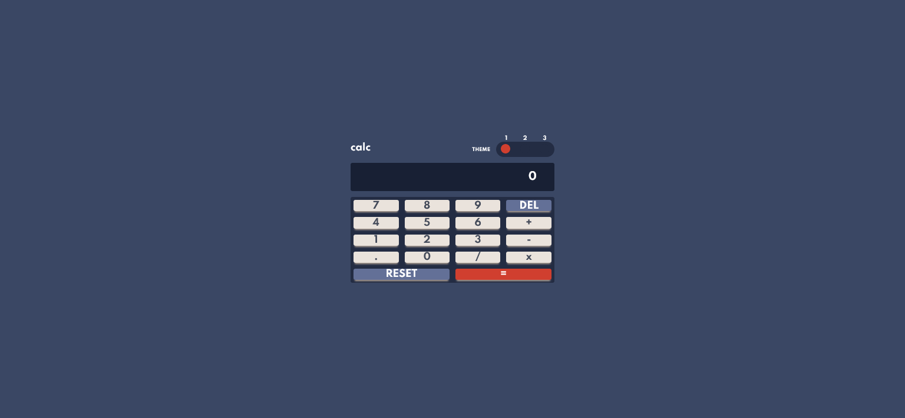

# Calculator task from Frontend mentor challenges

## Table of contents

- [Overview](#overview)
  - [The challenge](#the-challenge)
  - [Screenshot](#screenshot)
  - [Links](#links)
- [My process](#my-process)
  - [Built with](#built-with)
- [Author](#author)
- [Acknowledgments](#acknowledgments)

**Note: Delete this note and update the table of contents based on what sections you keep.**

## Overview

### The challenge

Users should be able to:

- See hover states for all interactive elements on the page
- See a live countdown timer that ticks down every second (start the count at 14 days)
- **Bonus**: When a number changes, make the card flip from the middle

### Screenshot

### Links

- Live Site URL: [Live](https://frontend-calculator.netlify.app/)

### My process

## Testing and developing

During development I used Storybook compose my components.
I also used Storybook for snapshot testing and the Jest library for unit testing.

## Styling

For styling I used styled-components due to it's ability to pass props to the style attributes, and thus making theme-styling easier.

## Context

I used ThemeProvider from the styled-components library in order to pass my styling attributes to the components and also for the calculations of the calculator.

### Built with

- Semantic HTML5 markup
- CSS custom properties
- Flexbox
- Mobile-first workflow
- [React](https://reactjs.org/) - JS library
- [Styled Components](https://styled-components.com/) - For styles and theming.

## Author

- Website - [Nitsan Cohen](https://nitsan-portfolio.netlify.app/)
- Frontend Mentor - [@Nitsan Cohen](https://www.frontendmentor.io/profile/NitsanCohen770)
- Linkedin - [@Nitsan Cohen](https://www.twitter.com/yourusername)

**Note: Delete this note and add/remove/edit lines above based on what links you'd like to share.**

## Acknowledgments

Thanks for my brother Omer Cohen, for always being there when I was struggling :)
